

  
   
  

# 🌎 수줍 [SOOJOOB]

- 서비스명 : 수줍 [SOOJOOB]
- 개발기간 : 2022.07.11 ~ 2022.8.19 (5주)
- 팀명 : 프리지아🌻

    - **프리**티한 **지**구가 **아**파요 🤎🌏😷 

  

# 🍀 서비스 소개

   ### 1. 수줍(SOOJOOB)이란?
   - 🏃‍♂️달리고 걸을 때 🍥쓰레기를 주워 💪나의 건강과 지구의 건강을 함께 지키는 앱

   ### 2. 서비스 기획 배경

    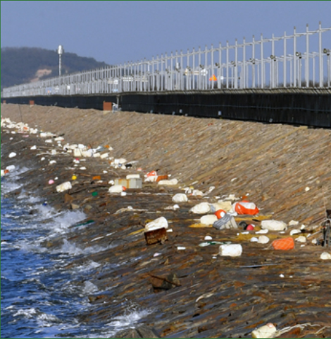
    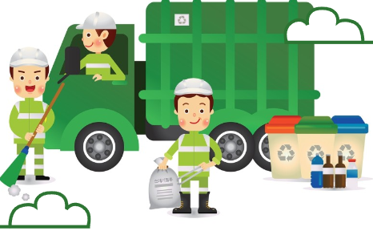

   
   - 길에 보이는 쓰레기들이 장마철에 바다로 흘러가는 현상
   - 환경미화원의 업무량 과다 및 인력 부족
   - 단순히 일정기간의 캠페인에서 그치는 것이 아니라 일상에서 언제나 참여할 수 있는 플로깅 플랫폼을 만들자!

  

# 🌈 주요 기능
  ### 🏠 메인화면
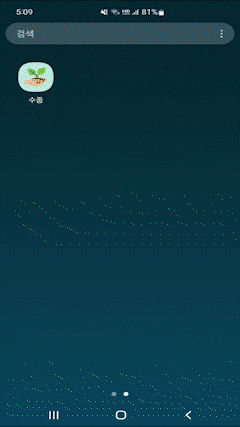

  ### 👶 사용자 관리
> + ##### 회원가입, 로그인/로그아웃, 회원정보 수정, 회원탈퇴, 마이페이지
> + ##### 토큰을 활용해~~
> + ##### 나의 프로필을 볼 수 있고 개인 정보를 수정하는 페이지
> + ##### 프로필 사진, 닉네임, 손수 줍기 횟수, 활동 배지, 개인정보 수정
    1. 회원가입

    2. 로그인 / 로그아웃

    3. 회원정보 수정 및 비밀번호 변경

    4. 회원탈퇴

    5. 마이페이지
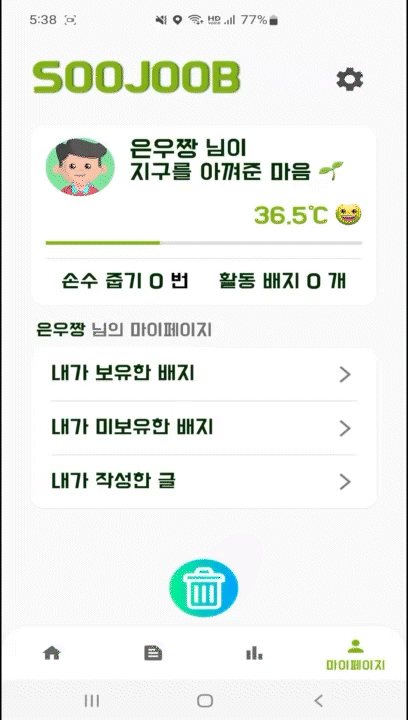
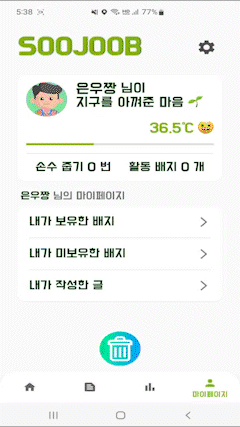
  

  ### 🌺 플로깅을 기록하고 공유
> + ##### 지도 기반으로 Plogging을 시작할 수 있는 페이지
> + ##### Google Map api를 활용해 현재 위치 표시 및 주변에 있는 화장실이나 쓰레기통 클러스팅 표시
> + ##### 플로깅한 경로를 트래킹하고 시간, km를 계산하여 제공
    1. 카운팅, 마킹, 폴리라인
      - 쓰레기를 주울 때 카운팅
      - 주운 위치에 꽃이 피어나서 지도에 마칭
      - 지나간 길은 폴리라인으로 경로 확인 가능
  
  &nbsp;&nbsp;&nbsp;&nbsp;
  
 
  
  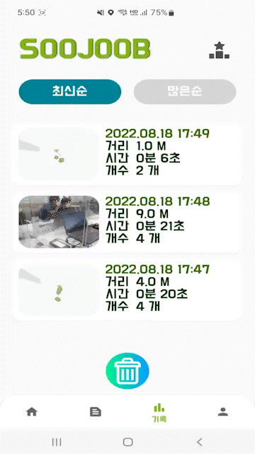

    2. 주변 위치 정보 제공
      - 주변 쓰레기통 위치 정보 제공
      - 주변 화장실 위치 정보 제공
  

    3. SNS 사진 공유
      - 기록에는 마킹과 폴리라인이 된 지도 사진이 기본 연동
      - 필요 시 유저가 커스텀한 사진으로 변경 가능
      - SNS 공유 기능
  

### 🏆 경혐치 & 업적 배지! 랭킹시스템까지! 참여율 UP UP!!
> + ##### 특정조건을 달성하면 배지 획득 가능
> + ##### 배지를 클릭하면 달성 조건을 확인할 수 있는 페이지
> + ##### 플로깅 결과에 따른 유저 경험치(온도), 랭킹을 확인할 수 있는 페이지
> + ##### 목표 달성을 통한 동기부여 제공
    1. 온도 경험치 시스템
      - 활동 기록에 따라 온도 경첨치 산정
      - 36.5°C부터 100°C까지 열정이 불타요!
 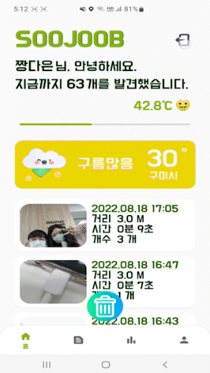 
    2. 업적 배지

      - 특정 조건이나 이스터에그 발견 시 얻을 수 있는 배지 시스템
 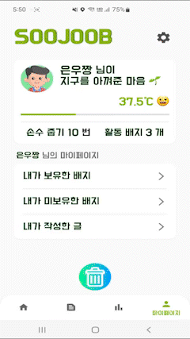 

      - 아직 획득하지 못한 배지를 노리고 도전하는 재미
 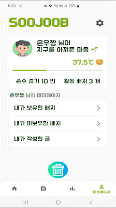 
    3. 랭킹
      - 랭킹확인
 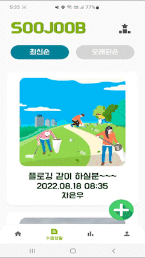 

### 📝 게시글 작성
    1. 사진, 게시글 작성

    2. 최신순, 많은 순
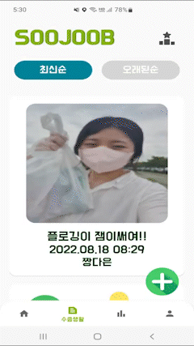

  

# 💡 '수줍'하면 일어나는 기대효과!
   1. 성취감
   2. 운동효과
   3. 선한 영향력

  

# 🏃 향후 계획
   1. 쓰레기 분류 기능
   2. 헬스 API
   3. Wear OS 활용

  

# 💻 기술 스택
> ### Front-End : Kotlin 1.8, Retrofit
> ### Back-End : Java 1.8, Spring Boot 2.6.1, java, JWT, Security, Oauth 2.0
> ### Server : Ubuntu 20.04, AWS, S3
> ### DB : MySQL 8.0.28
> ### 기획 : Figma, Notion, JIRA, GitLab, ERD Cloud

  

# 👨‍👩‍👧‍👦 팀원 역할
| 팀원 | 역할 | 역할 | 담당 업무 | 한 줄 소감
| ------ | ------ | ------ |------ | ----- |
| 이재영 | 팀장 | Front-End | JIRA 관리, Android, UI/UX, DB설계, 기능명세서 | 시간이 부족해서 기획했던 기능들을 마저 구현하지 못해 아쉽습니다. |
| 김다은 | 팀원 | Back-End | AWS S3, DB설계, 기능명세서 | Spring과 Android와 많이 친해진거 같아요! |
| 박민진 | 팀원 | Back-End | AWS S3, DB설계, 기능명세서 | 새로운 것을 배우면서 성장할 수 있는 경험이었습니다. |
| 박찬석 | 팀원 | Front-End | Android, UI/UX, 기능명세서 | Kotlin과 친해질 수 있는 소중한 경험이었습니다. |
| 박한훈 | 팀원 | Front-End | Android, UI/UX, 기능명세서 | 모든 것이 처음이라 낯설었지만 후회없는 선택이었습니다. |
| 홍석현 | 팀원 | Back-End | AWS S3, DB설계, 기능명세서 | 다양한 기술스택을 경험할 수 있는 좋은 기회였습니다. |

  

# 🎥 UCC 링크
<https://youtube.com>

 

# 📚 산출물
#### [DB] https://www.  
#### [와이어프레임] https://www.  
#### [기능명세서] https://www.  
#### [Notion] https://www.notion.so/d210/SSAFY-8d8771c733e7469e93c6bc9bb7c9efa3
#### [프로젝트 계획서] https://www.  
#### [최종 발표 자료 및 UCC] https://www  

#