# 시연 시나리오


#### 로그인 화면

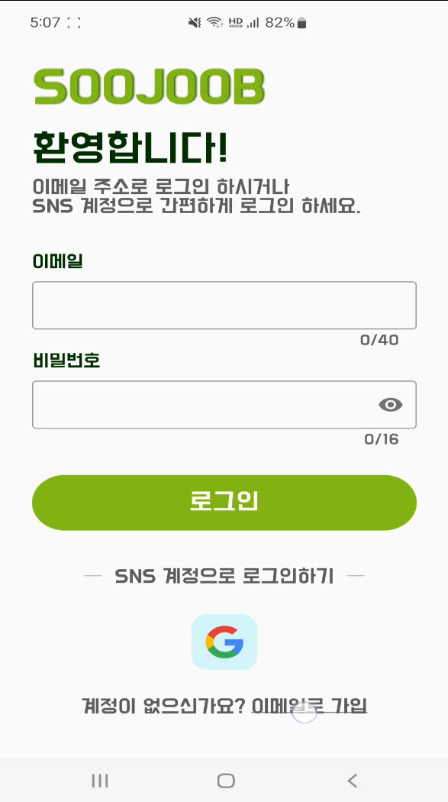

```
이메일과 비밀번호로 로그인이 가능하며
구글계정으로 로그인도 지원합니다.
이메일이나 비밀번호 오류시 Toast창으로 정보 확인을 권고합니다.
이메일로 가입 버튼을 누르면 회원가입으로 이동합니다.
```


#### 회원가입 화면

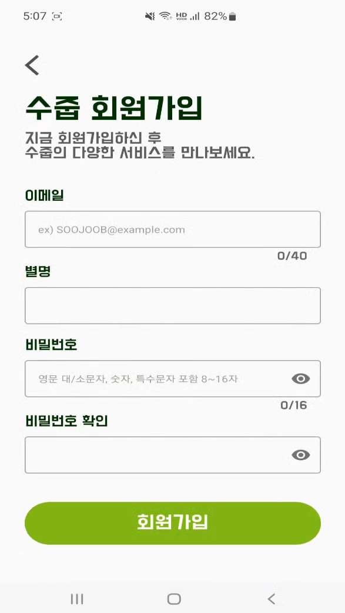

```
이메일과 별명이 중복일시 회원가입이 되지 않고 알림창이 뜹니다.
정해진 포맷을 맞추어 입력해야 정상적으로 회원가입이 진행됩니다.
회원가입이 되면 로그인 화면으로 이동합니다
```


#### 홈 화면

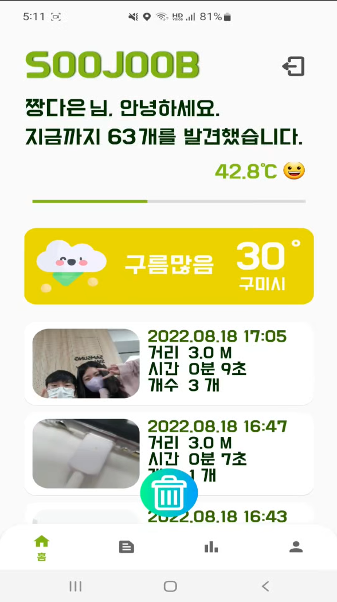

```
회원 환영 문구와 쓰레기를 주운 개수, 온도가 표시됩니다.
현재 위치와 날씨를 위젯으로 확인할 수 있으며
플로깅 기록들이 나타납니다
아래 네비게이션 바를 통해 다른 메뉴로 이동할 수 있습니다.
우측 상단 버튼을 클릭하면 로그아웃 후 로그인화면으로 이동합니다.
중앙 하단 버튼을 통해 플로깅 화면으로 이동할 수 있습니다.
```


#### 수줍생활(커뮤니티)

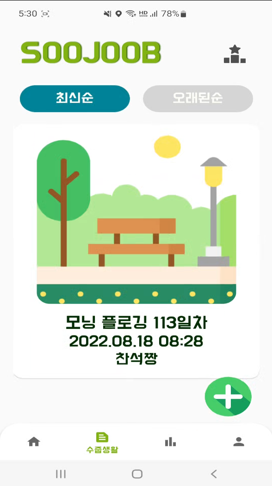

```
수줍의 커뮤니티인 수줍생활에서 최신순/오래된순으로 게시글 정렬 가능
사진과 제목, 내용을 작성 가능합니다.
각 게시글을 누르면 상세페이지로 이동합니다.
```


#### 수줍 어워즈(랭킹)

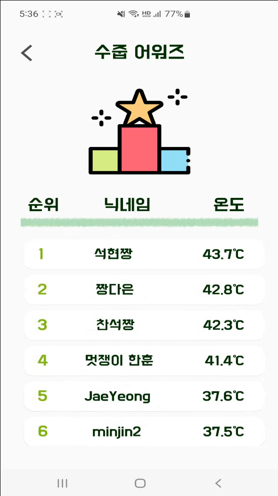

```
회원들의 순위와 닉네임, 온도를 확인할 수 있습니다.
```


#### 마이페이지

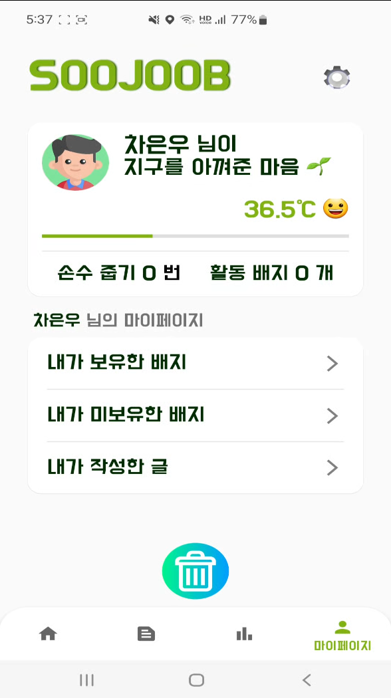

```
마이페이지에서
내가 보유한 배지, 내가 미보유한 배지, 내가 작성한 글
그리고 우측상단 톱니바퀴모양인 회원정보 수정 페이지로 이동할 수 있습니다
```


#### 회원정보 수정

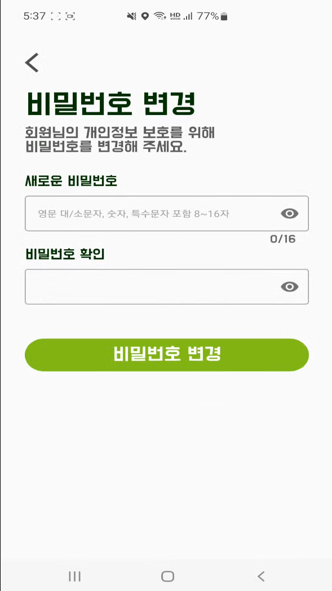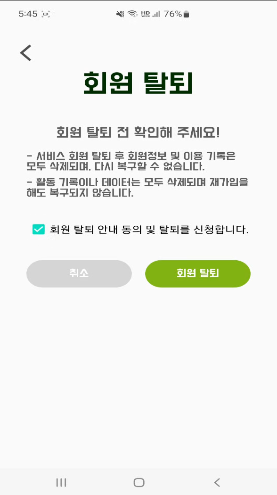

```
별명, 이메일, 나이, 주 활동 지역을 수정할 수 있으며
비밀번호 변경은 영문 대/소문자, 숫자, 특수문자 포함 8~16자를 만족해야 변경가능

회원탈퇴는 체크박스를 클릭해야 활성화
```


#### 플로깅 화면

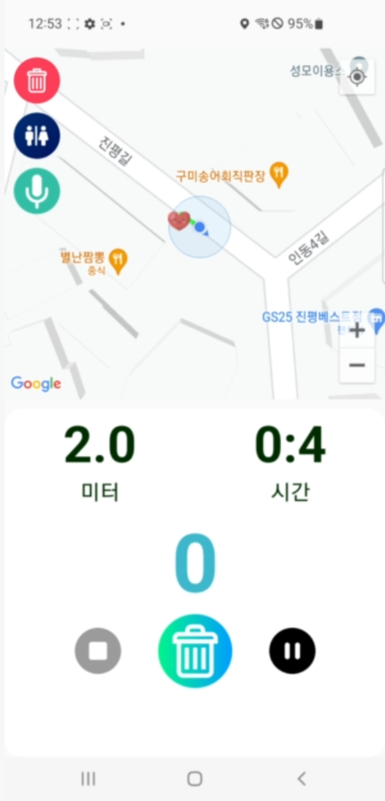

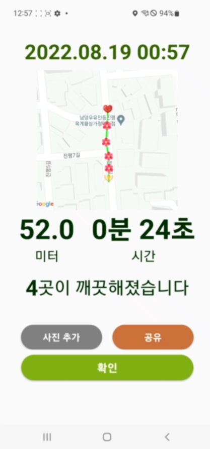


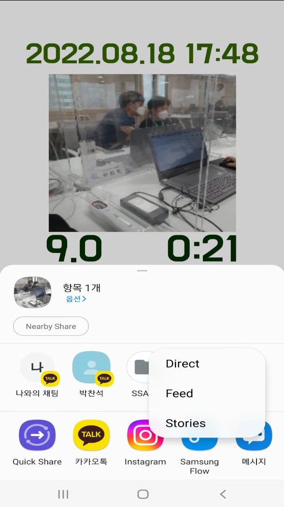

```
플로깅 시작버튼을 누르면 플로깅 진행이 가능하며 폴리라인이 그려집니다.
TTS로 '플로깅을 시작합니다' 같은 직관적인 멘트를 들을 수 있습니다.
쓰레기 카운팅 버튼을 통해 쓰레기 개수를 체크할 수 있습니다
플로깅을 끝낸 후에는 사진을 그려진 폴리라인이 저장되며 인증사진을 찍을 수 있습니다.
sns 공유하기 기능을 통해 내 사진을 공유할 수도 있습니다.
```


#### 배지 페이지

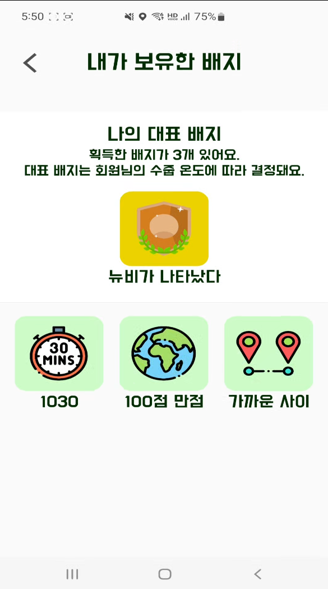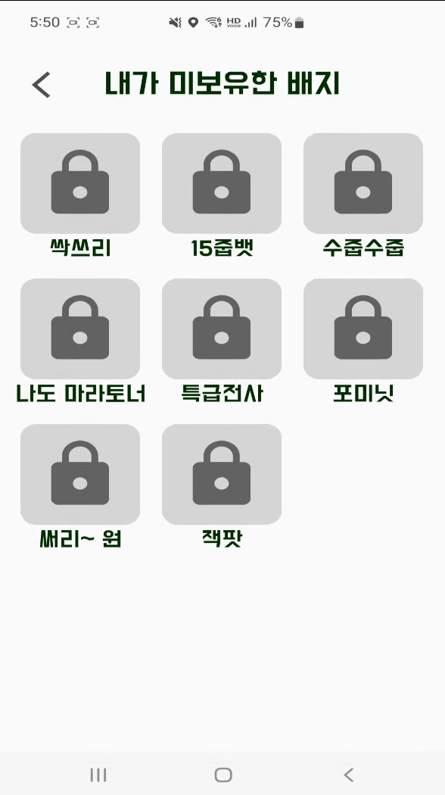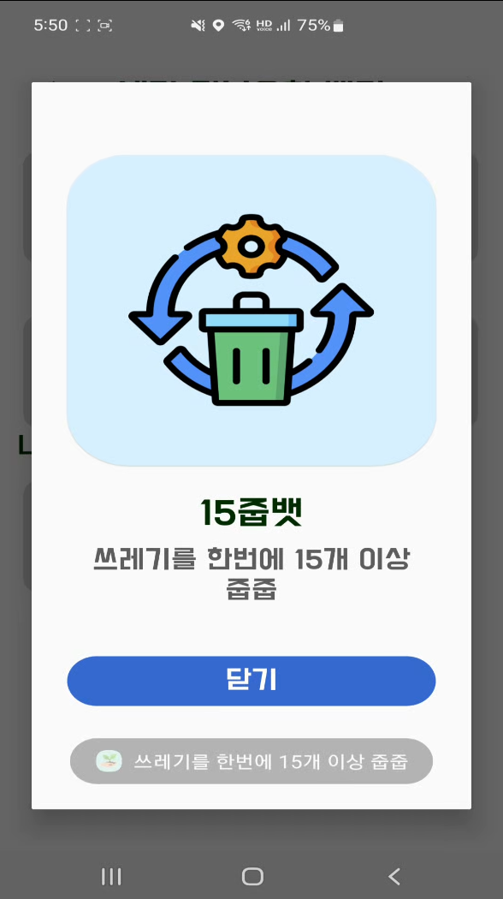

```
내가 보유한 배지와 미보유한 배지를 확인할 수 있습니다.
대표 배지는 회원의 온도에 따라 결정됩니다.
각 배지를 누르면 상세 정보를 확인할 수 있는 다이얼로그가 뜹니다.
```

